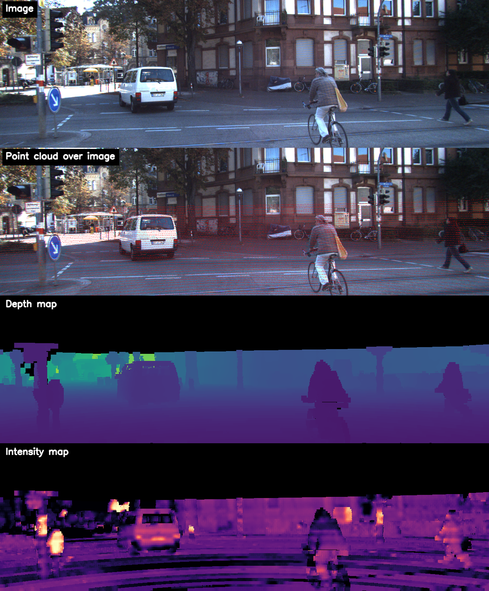
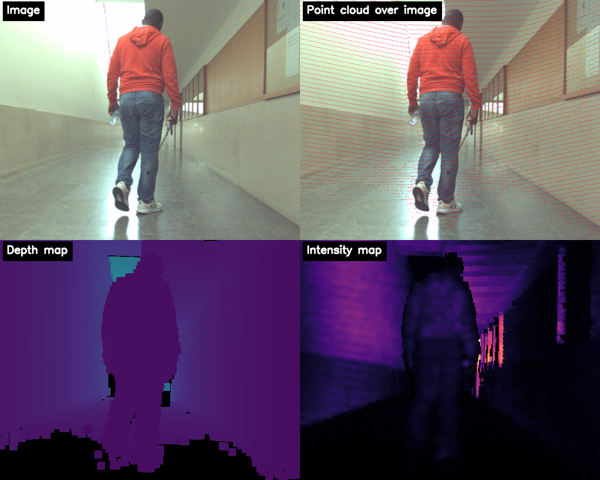

# Sparse2Dense

`Sparse2Dense` is the name of this framework.

This project is a PyTorch re-implementation of the method described in the paper **High-resolution LIDAR-based Depth Mapping using Bilateral Filter**. It includes a CPU reference path and a PyTorch + CUDA path for acceleration when a compatible GPU is available.

## Original Work

**Title:** High-resolution LIDAR-based Depth Mapping using Bilateral Filter

**Link:** https://ieeexplore.ieee.org/abstract/document/7795953

**Authors:** Cristiano Premebida, Luis Garrote, Alireza Asvadi, A. Pedro Ribeiro and Urbano Nunes

**Affiliation:** The authors are with the Institute of Systems and Robotics, Dept. of Electrical and Computer Engineering, University of Coimbra, Portugal.

**Contact:** `{cpremebida,garrote,asvadi,urbano}@isr.uc.pt`

## BibTeX Citation

```bibtex
@inproceedings{premebida2016high,
  title={High-resolution lidar-based depth mapping using bilateral filter},
  author={Premebida, Cristiano and Garrote, Luis and Asvadi, Alireza and Ribeiro, A Pedro and Nunes, Urbano},
  booktitle={2016 IEEE 19th international conference on intelligent transportation systems (ITSC)},
  pages={2469--2474},
  year={2016},
  organization={IEEE}
}
```

## Visual Examples

**KITTI dataset**  
Dataset link: https://www.cvlibs.net/datasets/kitti/



**MID-3K dataset**  
Dataset link: https://github.com/kennedyk1/MID-3K



## What This Framework Does

`Sparse2Dense` takes:

- one RGB image path or one folder of RGB images
- one point-cloud path or one folder of point clouds
- one calibration YAML file
- one output folder

It then generates:

- `depth_map/`
- `intensity_map/`
- `debug_images/`
- `info.txt`

Supported point-cloud formats:

- `.bin`
- `.ply`
- `.pcd`
- `.txt`
- `.csv`

For `.txt` and `.csv`, the framework automatically detects common delimiters such as spaces, tabs, commas, semicolons and pipes.

If the user has another format, the recommended workflow is to convert it to `.txt` or `.csv` with columns:

```text
x y z intensity
```

If intensity is not available, the file may also contain only:

```text
x y z
```

## Installation

Typical Python dependencies:

```bash
pip install numpy opencv-python pillow pyyaml numba torch
```

For GPU acceleration, install a PyTorch build with CUDA support.

## API

Main entry point:

```python
Sparse2Dense.generate(...)
```

Main arguments:

- `image_input`: image file path or folder path
- `pointcloud_input`: point-cloud file path or folder path
- `calibration_yaml`: YAML file with `intrinsics_4x4` and `lidar_to_camera_4x4`
- `output_folder`: output directory, created automatically if it does not exist
- `depth_mask_size`: odd integer, default `13`
- `intensity_mask_size`: odd integer, default `13`
- `depth`: `True` or `False`, default `True`
- `intensity`: `True` or `False`, default `True`
- `debug`: `True` or `False`, default `True`
- `ratio_threshold`: float, default `0.15`
- `jump_threshold`: float, default `0.01`
- `device`: `"cpu"` or `"cuda"`. If omitted, the framework uses `"cuda"` when available, otherwise `"cpu"`

## example.py

Below is the current `example.py`, with comments and possible values for each argument:

```python
import Sparse2Dense


# Example 1:
# Process a full KITTI sequence folder.
#
# image_input:
#   - one image file path
#   - or one folder containing images
#
# pointcloud_input:
#   - one point cloud file path
#   - or one folder containing point clouds
#   - accepted formats: .bin, .ply, .pcd, .txt, .csv
#
# calibration_yaml:
#   - YAML file with `intrinsics_4x4` and `lidar_to_camera_4x4`
#
# output_folder:
#   - output directory created automatically if it does not exist
#
# depth_mask_size / intensity_mask_size:
#   - positive odd integers such as 7, 11, 13, 15, 17, 19, 25
#   - the paper reports mr = 13 as the best overall value
#
# depth / intensity / debug:
#   - True or False
#
# ratio_threshold / jump_threshold:
#   - floating-point parameters for foreground/background cluster selection
#
# device:
#   - "cpu"
#   - "cuda"
#   - if omitted in the API, Sparse2Dense uses "cuda" when available, otherwise "cpu"
summary_kitti = Sparse2Dense.generate(
    image_input="dataset_examples/KITTI/data_tracking_image_2/training/image_02/0000/",
    pointcloud_input="dataset_examples/KITTI/data_tracking_velodyne/training/velodyne/0000",
    calibration_yaml="dataset_examples/KITTI/calibration.yaml",
    output_folder="output_examples/KITTI",
    depth_mask_size=13,
    intensity_mask_size=13,
    depth=True,
    intensity=True,
    debug=True,
    ratio_threshold=0.15,
    jump_threshold=0.01,
    device="cuda",
)
print(summary_kitti)


# Example 2:
# Process the MID-3K example folders.
summary_MID_3K = Sparse2Dense.generate(
    image_input="dataset_examples/MID-3K/MID-3K-rgb/images/",
    pointcloud_input="dataset_examples/MID-3K/MID-3K-pcd/pcd/",
    calibration_yaml="dataset_examples/MID-3K/calibration.yaml",
    output_folder="output_examples/MID-3K",
    depth_mask_size=17,
    intensity_mask_size=17,
    depth=True,
    intensity=True,
    debug=True,
    ratio_threshold=0.15,
    jump_threshold=0.01,
    device="cuda",
)
print(summary_MID_3K)
```

## YAML Format

The framework expects a calibration YAML file with the following structure:

```yaml
intrinsics_4x4:
  - [fx, s, cx, tx]
  - [0.0, fy, cy, ty]
  - [0.0, 0.0, 1.0, tz]
  - [0.0, 0.0, 0.0, 1.0]

lidar_to_camera_4x4:
  - [r11, r12, r13, tx]
  - [r21, r22, r23, ty]
  - [r31, r32, r33, tz]
  - [0.0, 0.0, 0.0, 1.0]
```

Field meaning:

- `intrinsics_4x4`: camera projection/intrinsics matrix used by the framework
- `lidar_to_camera_4x4`: rigid transform from the LiDAR frame to the camera frame

For datasets where rectification is required, the final rectified transform should already be folded into `lidar_to_camera_4x4`.

## Minimal YAML Example

```yaml
intrinsics_4x4:
  - [721.5377, 0.0, 609.5593, 44.85728]
  - [0.0, 721.5377, 172.854, 0.2163791]
  - [0.0, 0.0, 1.0, 0.002745884]
  - [0.0, 0.0, 0.0, 1.0]

lidar_to_camera_4x4:
  - [0.00023477369814709513, -0.9999441545437641, -0.010563477811052452, -0.002796816941295463]
  - [0.010449407416585328, 0.010565353641379827, -0.9998895741176479, -0.07510879138296075]
  - [0.9999453885619523, 0.00012436537838645572, 0.010451302995667028, -0.2721327964059351]
  - [0.0, 0.0, 0.0, 1.0]
```

## Output Structure

Example output layout:

```text
output_examples/
└── KITTI/
    ├── depth_map/
    ├── intensity_map/
    ├── debug_images/
    └── info.txt
```

## Notes

- The paper reports `mr = 13` as the best overall window size in its experiments.
- In this framework, `mr` corresponds to `depth_mask_size` or `intensity_mask_size`.
- When `depth_mask_size == intensity_mask_size`, the framework reuses the same densification pass for both outputs.
- `device="cuda"` is recommended when a compatible GPU is available.
